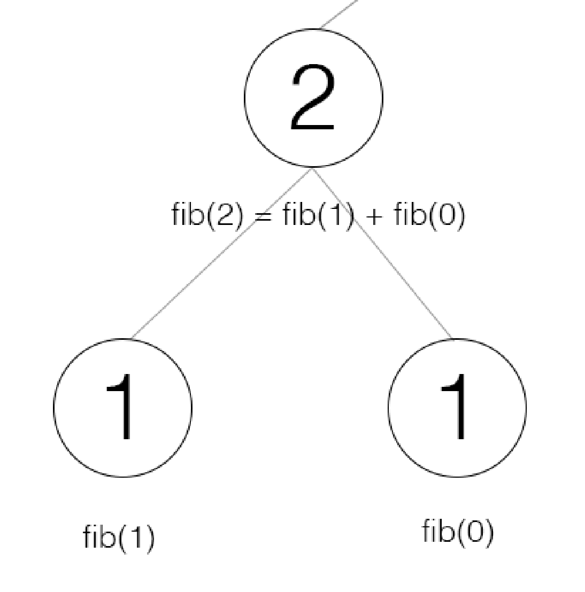
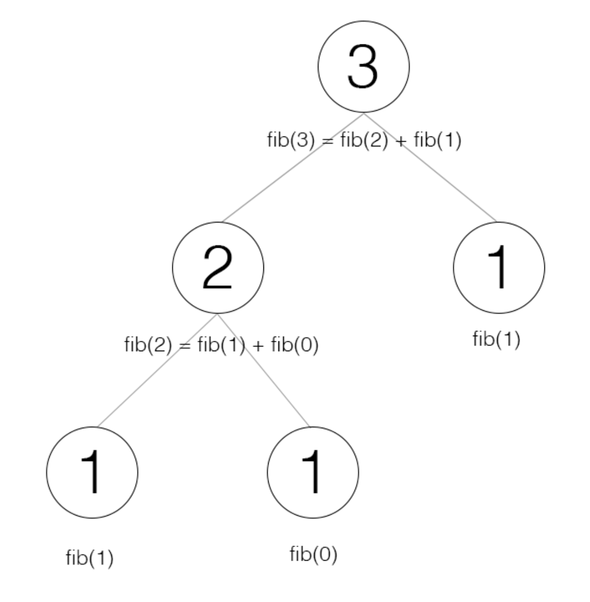
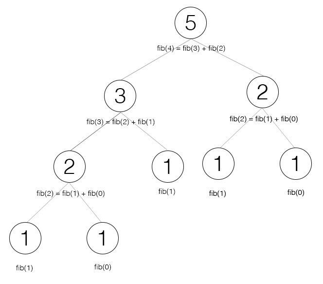
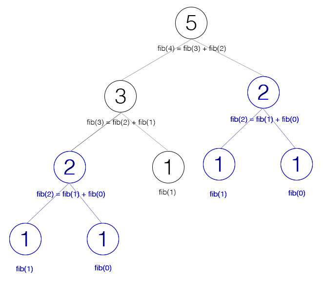
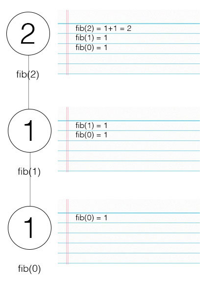
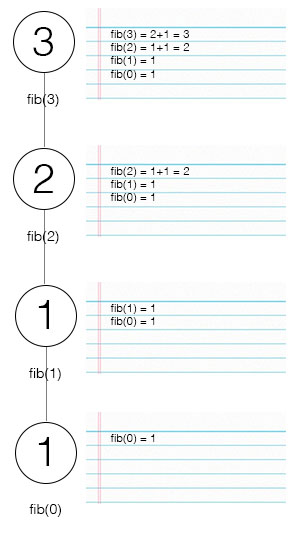
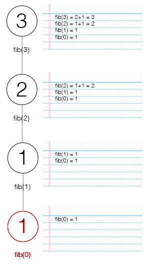

# From Recursion to Linearization: Fibonacci

A lot of problems which exist in CS might first appear very complicated or unclear, yet it remains desirable to find a fast and efficient solution. For a subset of these problems, it is possible to make simple yet beneficial observations in order to develop a recursive solution.

However, recursion is notorious for involving lots of redundant computation and also (without continuation passing style) requires enough stack space to support the depth of the problem. But in many cases, it is possible to convert this type of solution into one which uses a single loop and a single stack frame.

As an example, I'm going to use the fibonacci function. The fibonacci function takes in an index parameter and returns the number at that index within the fibonacci series. To remind you, here's what the fibonacci series looks like:

`1, 1, 2, 3, 5, 8, ...`

So we would define `fib(0) = 1`, `fib(1) = 1`, `fib(2) = 2`, and so on.

Let's say we are given this sequence, and its definition:

> fib(0) = 1, fib(1) = 1, and fib(n) = fib(n - 1) + fib(n - 2)

That is, every value after the first two is the sum of the two before it.

We can write this relation as a simple recursive python function:

```python
def fib(n):
  if n == 0 or n == 1:
    return 1
  return fib(n - 1) + fib(n - 2)
```

To compute `fib(n)`, we first compute `fib(n-1)` and `fib(n-2)`, and then add them together. Since the first two values of the series are known, there is no risk of an infinite loop as long as `n` exceeds 0.

The following is an illustration of how `fib(2)` gets computed:



To compute `fib(2)`, we first compute `fib(1)` and `fib(0)`, and then add them together.

Let's see how the tree looks for `fib(3)`:



To compute `fib(3)`, we first compute `fib(2)` and `fib(1)`, and then add them together.

* The real problem with the recursive solution arises when we illustrate the tree for `fib(4)`:



To compute `fib(4)`, we first compute `fib(3)` and `fib(2)`, and then add them together. However, in this tree, we can notice that we're actually computing `fib(2)` twice, once when we compute `fib(4)`, and once when we compute `fib(3)`:



As you can imagine, this observation is the root of a *lot* of redundant computation. So much so that our current implementation of `fib` has a worst case runtime of **O(2<sup>n</sup>)**. That is, the number of nodes in the above tree is at most a multiple of **2<sup>n</sup>** for `fib(n)`.

What we instead want is that when we compute `fib(n)`, we already have `fib(n-1)` and `fib(n-2)` sitting in our hands, so that we can directly add them to produce `fib(n)`.

So how about, every time we compute a fibonacci number at a given index `n`, we write down the result. That way, when we go to compute the next value, we just have to look at what we have written down.

Allow me to illustrate:



When we go to compute `fib(2)`, we already have what `fib(1)` and `fib(0)` compute to, so we simply add what we have already written down. Then, we write down the result of computing `fib(2)`, which is `2`.



When we go to compute `fib(3)`, we already have what `fib(2)` and `fib(1)` compute to, so we simply add what we have written down. Then, we write down the result of computing `fib(3)`, which is `3`.

Now that we've removed the computational redundancy, our worst case runtime is **O(n)**, meaning that there will be at most a multiple of **n** nodes in the above graph for `fib(n)`. Splendid!

> The process that we just went through is called **memoization**. That is, we are writing down a **memo** of each subresult throughout the computation, so that we can use it later.

In python, the equivalent of writing down a memo is creating a dictionary that maps a given input parameter `n` to the physical value of `fib(n)`. Here's what the code for our updated function might look like:

```python
def fib(n):
  memos = dict()
  # write down that fib(0) is 1
  memos[0] = 1
  # and fib(1) is 1
  memos[1] = 1
  
  for k in range(2, n + 1):
    # write down that fib(k) is fib(k-1) + fib(k-2)
    memos[k] = memos[k - 1] + memos[k - 2]
  
  # return what we have written for fib(n)
  return memos[n]
```

Now, one last thing. We can further observe that although we are writing down the result for every single value of `fib` from `0` to `n`, when we go to compute `fib(n)`, we only need `fib(n-1)` and `fib(n-2)`.



After we have computed `fib(2)`, we will never use `fib(0)` again. From the above diagram, when we compute `fib(3)`, we only care about what `fib(1)` and `fib(2)` are.

Aka, we don't have to write down every single value. We only need to write down what the last two were in order to compute the next one.

Here's the updated version of our code, where we only keep track of what the last two computed values were in order to compute what the next one should be.

```python
def fib(n):
  # write down that fib(n-1) is 1
  fib_n_minus_one = 1
  # and that fib(n-2) is 1
  fib_n_minus_two = 1
  
  # write down default value for fib(n), in case n < 2
  fib_n = 1
  
  for k in range(2, n + 1):
    # fib(n) = fib(n-1) + fib(n-2)
    fib_n = fib_n_minus_one + fib_n_minus_two
    
    # update what we have written for fib(n-1) and fib(n-2)
    # for the next iteration
    fib_n_minus_two = fib_n_minus_one
    fib_n_minus_one = fib_n
  
  # return what we have written for fib(n)
  return fib_n
```

Although we can further simplify this code to use fewer variables, I believe that this is the clearest way to write it.

> The process of updating code that uses memoization to only remember old values which are necessary is called **linearization**.

Although we applied the process of converting from recursion to linearization on a simple example, this technique can be applied to find optimal solutions for a lot of seemingly complex real-world problems, many of which are asked in the form of job interview questions.

For example:

* Given a staircase, where at any given point in the staircase you can go up one or two steps, determine how many number of ways there are to reach the top.
* Implement a version of regex that supports character matching, `.` (match any character), and `*` (match zero or more of the character which was previously seen)
* Given a string of numbers, determine how many different possible ways in which the string could be decoded into an ip. For example, the string `25525511125` has `2` different possible decodings: `255.255.111.25` and `255.255.11.125`

The optimal solutions for each of these problems can be discovered by first developing a recursive solution, and then carefully shaping it into a linearized solution.